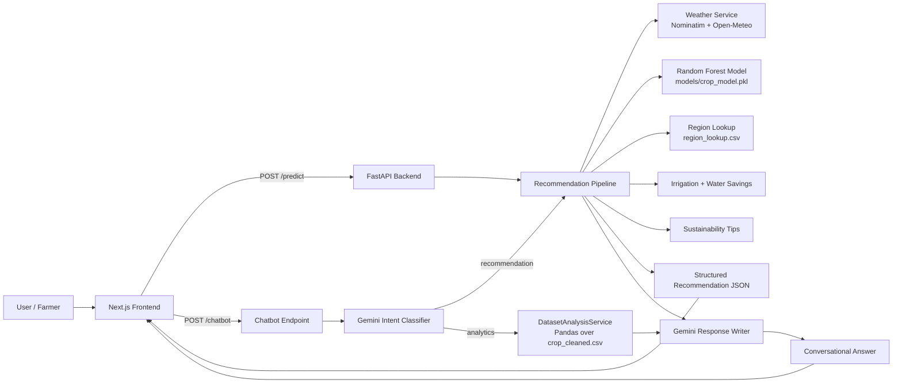
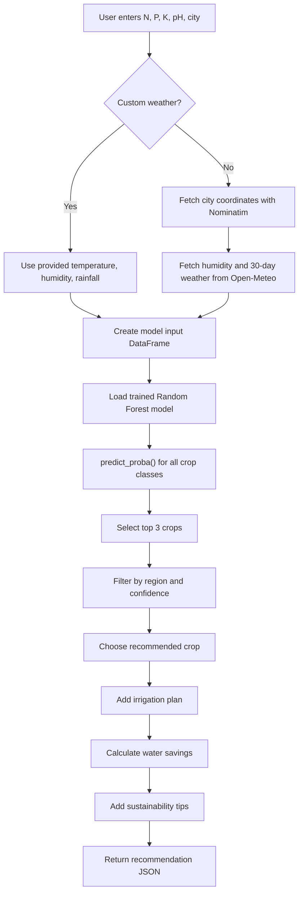
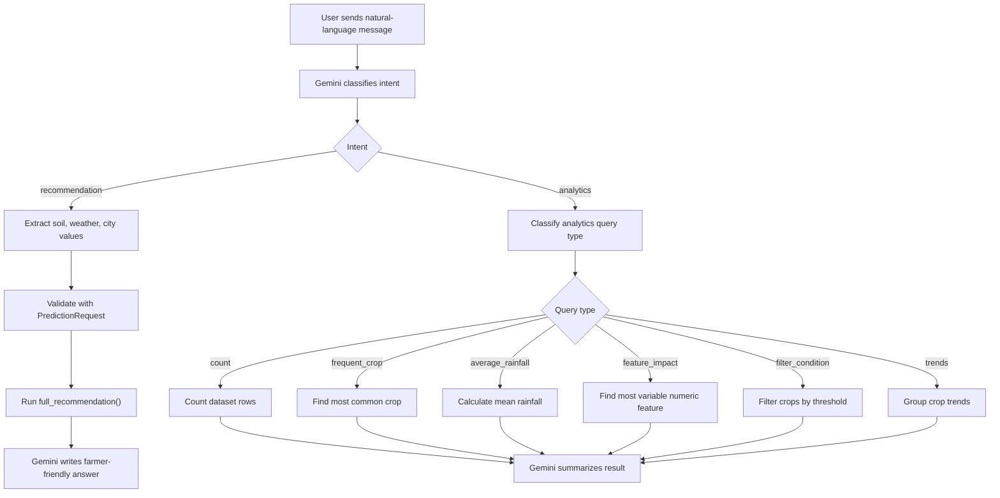
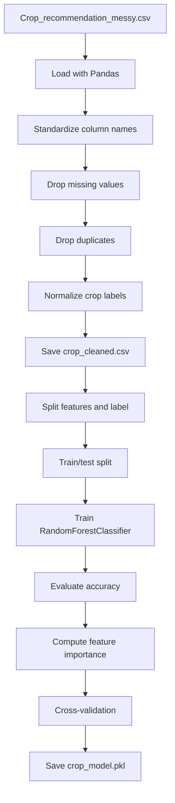
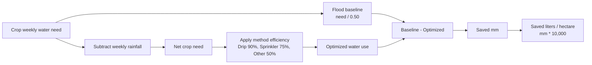
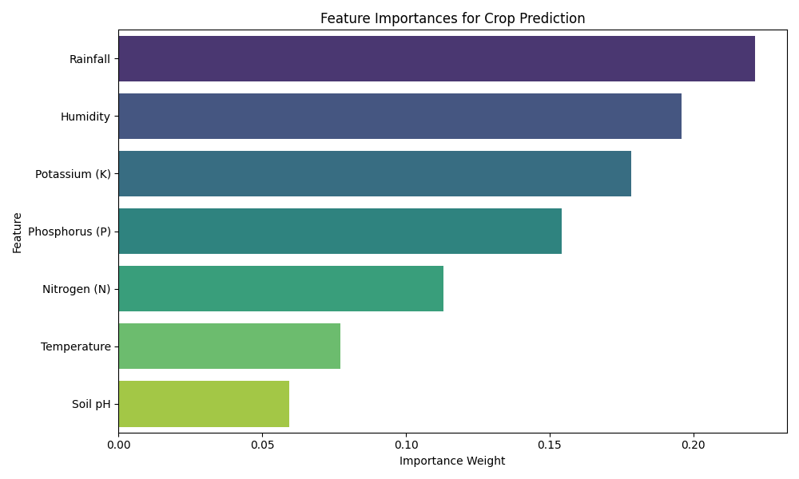
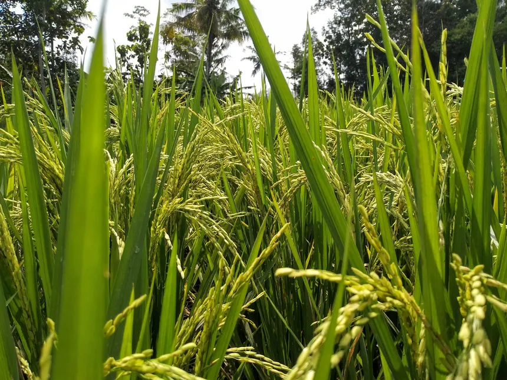
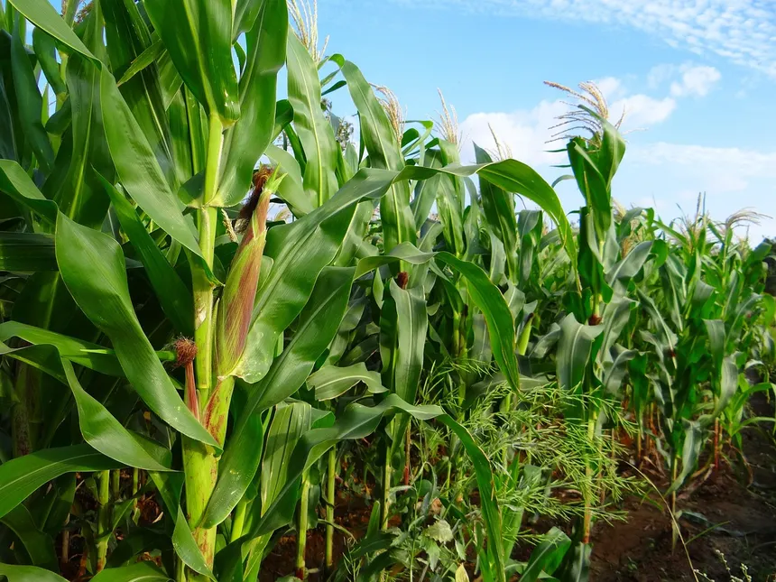
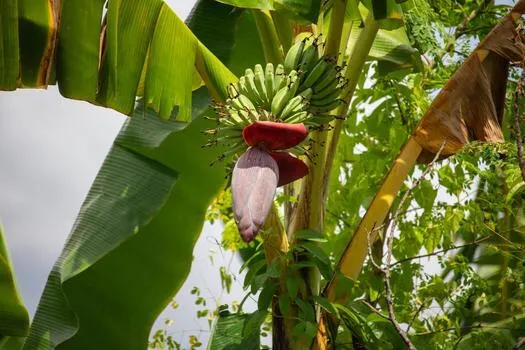

# FarmForesight / AiForesight

FarmForesight is a full-stack agricultural recommendation system. It combines a
Scikit-learn crop classification model, real weather data, regional water
context, irrigation heuristics, sustainability guidance, and a Gemini-powered
chatbot into one farmer-facing web app.

The system can be used in two ways:

- A structured form where the user enters soil metrics and location.
- A natural-language assistant where the user can ask for crop recommendations
  or ask simple questions about the dataset.

## Table of Contents

- [Project Goals](#project-goals)
- [Architecture](#architecture)
- [Visual Overview](#visual-overview)
- [Repository Structure](#repository-structure)
- [Backend API](#backend-api)
- [Recommendation Pipeline](#recommendation-pipeline)
- [Chatbot and Analytics Pipeline](#chatbot-and-analytics-pipeline)
- [Machine Learning Training](#machine-learning-training)
- [Data Files](#data-files)
- [Irrigation and Water Savings Logic](#irrigation-and-water-savings-logic)
- [Frontend](#frontend)
- [Setup and Running Locally](#setup-and-running-locally)
- [Testing and Batch Prediction](#testing-and-batch-prediction)
- [Environment Variables](#environment-variables)
- [Known Limitations](#known-limitations)
- [Future Improvements](#future-improvements)

## Project Goals

This project helps farmers and agriculture students answer:

- Which crop is most suitable for the current soil and climate conditions?
- What are the next-best crop alternatives?
- How confident is the model in its recommendation?
- What irrigation method and frequency should be used?
- How much water could be saved compared with traditional flood irrigation?
- What sustainability practices are suitable for the selected crop?
- What basic insights can be extracted from the training dataset?

## Architecture

```text
User
  |
  | Form input or chatbot message
  v
Next.js Frontend
  |
  | HTTP requests
  v
FastAPI Backend
  |
  | Structured recommendation path
  | - Load Random Forest model
  | - Fetch weather if needed
  | - Predict crop probabilities
  | - Filter by regional context
  | - Add irrigation, water savings, sustainability tips
  |
  | Chatbot path
  | - Use Gemini for intent classification and parameter extraction
  | - Route to recommendation or dataset analytics
  | - Use Gemini again for conversational response
  v
JSON response
  |
  v
Frontend result cards or chat answer
```

Core technologies:

- Backend: FastAPI, Pydantic, Pandas, Requests, Joblib
- ML: Scikit-learn RandomForestClassifier
- LLM: Google Gemini through `google-genai`
- Weather: Nominatim geocoding and Open-Meteo weather APIs
- Frontend: Next.js, React, TypeScript, Tailwind CSS, Axios, Framer Motion,
  Lucide React

## Visual Overview

This section gives a visual map of the project before the detailed technical
sections.

### System Architecture



### Main Recommendation Flow



### Chatbot Decision Tree



### Training Pipeline



### Water Savings Formula



### Feature Importance

The project includes a generated feature-importance chart from the model
analysis:



### Example Crop Assets

The frontend uses local crop images from `frontend/public/crops/` when rendering
recommendation results.

| Rice | Maize | Banana | Cotton |
| --- | --- | --- | --- |
|  |  |  |  |

## Repository Structure

```text
.
|-- app/
|   |-- main.py                  # FastAPI app and route definitions
|   |-- model.py                 # Loads models/crop_model.pkl
|   |-- predictor.py             # End-to-end recommendation pipeline
|   |-- analytics.py             # Dataset analytics service
|   `-- utils/
|       |-- weather.py           # City geocoding and weather fetching
|       |-- region.py            # Region lookup by district/city
|       |-- irrigation.py        # Irrigation and water-savings logic
|       `-- sustainability.py    # Crop-specific sustainability tips
|-- data/
|   |-- Crop_recommendation_messy.csv
|   |-- crop_cleaned.csv
|   |-- region_lookup.csv
|   |-- test.csv
|   `-- prediction.csv
|-- frontend/
|   |-- src/app/                 # Next.js app routes
|   |-- src/components/          # UI components
|   |-- src/lib/api.ts           # API client and TypeScript response types
|   `-- public/crops/            # Local crop images
|-- models/
|   `-- crop_model.pkl           # Trained Scikit-learn model
|-- notebooks/
|   |-- eda.py                   # Exported notebook logic
|   `-- eda.ipynb                # Exploratory data analysis and training
|-- test_script.py               # Batch prediction helper
|-- requirements.txt             # Python dependencies
`-- README.md
```

## Backend API

The backend is defined in `app/main.py`.

Default local URL:

```text
http://127.0.0.1:8000
```

### `GET /`

Health check endpoint.

Example response:

```json
{
  "status": "ok",
  "message": "Agricultural Recommendation System is running."
}
```

### `POST /predict`

Runs the deterministic crop recommendation pipeline.

Request body:

```json
{
  "n": 90,
  "p": 42,
  "k": 43,
  "ph": 6.5,
  "city": "Pune",
  "use_custom_weather": false
}
```

If `use_custom_weather` is `true`, provide all custom weather fields:

```json
{
  "n": 90,
  "p": 42,
  "k": 43,
  "ph": 6.5,
  "city": "Pune",
  "use_custom_weather": true,
  "temperature": 25,
  "humidity": 60,
  "rainfall": 100
}
```

Response shape:

```json
{
  "recommended_crop": "rice",
  "top_crops": [
    {
      "crop": "rice",
      "confidence": 98.12,
      "confidence_level": "High"
    }
  ],
  "temperature": 24.5,
  "humidity": 76,
  "rainfall_last_30_days": 142.3,
  "irrigation": {
    "method": "Maintain water levels",
    "frequency": "Regular monitoring",
    "priority": "Medium",
    "crop_stage": "Tillering/Heading",
    "water_requirement": "50-70 mm",
    "water_saved_liters_per_hectare": 400000,
    "water_baseline_liters_per_hectare": 1200000,
    "water_optimized_liters_per_hectare": 800000
  },
  "sustainability": [
    "Use alternate wetting and drying (AWD) to cut water use..."
  ],
  "reason": "Rice suits the current conditions..."
}
```

Errors:

- `400`: input is valid JSON but the system cannot produce a recommendation,
  for example weather lookup failed or no crop passed confidence filtering.
- `500`: unexpected backend error.

### `POST /chatbot`

Uses Gemini to understand a natural-language message. The chatbot supports two
intents:

- `recommendation`: extract soil/weather/location parameters and call the same
  `full_recommendation()` pipeline used by `/predict`.
- `analytics`: classify the dataset question, run a Pandas analysis query, then
  generate a conversational answer.

Request body:

```json
{
  "message": "My soil has 90 N, 42 P, 43 K and pH 6.5 in Delhi. Which crop should I grow?"
}
```

Response shape:

```json
{
  "response": "A conversational farming-advisor answer...",
  "parsed_data": {
    "n": 90,
    "p": 42,
    "k": 43,
    "ph": 6.5,
    "city": "Delhi"
  },
  "crop_data": {
    "recommended_crop": "rice",
    "top_crops": []
  }
}
```

For analytics queries, `crop_data` contains the analytics result returned by
`DatasetAnalysisService`.

Example analytics messages:

- "How many records are in the dataset?"
- "Which crop appears most often?"
- "What is the average rainfall?"
- "Which feature varies the most?"
- "Show crops where rainfall is above 200."

Errors:

- `429`: Gemini API rate limit.
- `503`: Gemini service unavailable or overloaded.
- `500`: missing Gemini client, missing API key, parsing error, or unexpected
  backend failure.

### Static Crop Assets

The backend also mounts crop image assets:

```text
/crops
```

This points to:

```text
frontend/public/crops
```

## Recommendation Pipeline

The main recommendation method is `full_recommendation()` in `app/predictor.py`.

Inputs:

- `n`: nitrogen value
- `p`: phosphorus value
- `k`: potassium value
- `ph`: soil pH
- `city`: city or district name
- `use_custom_weather`: whether to skip live weather lookup
- `temperature`, `humidity`, `rainfall`: optional custom weather values

Steps:

1. Resolve weather
   - If custom weather is provided, use it directly.
   - Otherwise call `get_weather_smart(city)`.

2. Build model features

   ```text
   n, p, k, temperature, humidity, ph, rainfall
   ```

3. Load model
   - `app/model.py` loads `models/crop_model.pkl` with Joblib at import time.

4. Predict probabilities
   - The model uses `predict_proba()` rather than only `predict()`.
   - The top 3 classes are selected by probability.

5. Label confidence

   ```text
   > 80%  -> High
   > 50%  -> Moderate
   <= 50% -> Low
   ```

6. Region filtering
   - `filter_crops_by_region()` looks up the city in `data/region_lookup.csv`.
   - Current rule: if the region climate is `arid`, remove `rice` and `jute`.

7. Confidence filtering
   - Crops below `20%` confidence are removed.
   - If no crops remain, the endpoint raises an error.

8. Enrichment
   - `recommend_irrigation()` adds method, frequency, and priority.
   - `enrich_irrigation()` adds crop stage, water requirement, warnings, and
     water-savings metrics.
   - `get_sustainability()` adds crop-specific sustainability practices.
   - `generate_reason()` creates a simple explanation string.

## Chatbot and Analytics Pipeline

The chatbot route is implemented in `app/main.py`.

### Intent Classification

Gemini receives an instruction prompt and returns a JSON object with:

```json
{
  "intent": "recommendation",
  "query_type": null,
  "feature": null,
  "threshold": 0
}
```

or:

```json
{
  "intent": "analytics",
  "query_type": "average_rainfall",
  "feature": null,
  "threshold": 0
}
```

The backend extracts JSON from the LLM response using a regular expression and
then routes the request.

### Recommendation Chat Flow

For recommendation messages:

1. Gemini extracts `n`, `p`, `k`, `ph`, `city`, and optional weather values.
2. Missing soil values are defaulted by the prompt to realistic values.
3. The parsed values are validated with the `PredictionRequest` Pydantic model.
4. The backend calls `full_recommendation()`.
5. Gemini converts the structured JSON into a conversational farming answer.

### Analytics Chat Flow

For analytics messages:

1. Gemini classifies the analytics query type.
2. `DatasetAnalysisService.execute_query()` routes to the correct Pandas method.
3. Gemini converts the raw result into a human-readable answer.

Supported analytics query types:

| Query type | Method | What it returns |
| --- | --- | --- |
| `count` | `get_total_records()` | Number of rows in `crop_cleaned.csv` |
| `frequent_crop` | `get_most_frequent_crop()` | Most common crop label and count |
| `average_rainfall` | `get_average_rainfall()` | Mean rainfall in mm |
| `feature_impact` | `get_feature_impact()` | Numeric column with highest standard deviation |
| `filter_condition` | `get_crops_by_condition()` | Crops matching a threshold such as `rainfall >= 200` |
| `trends` | `get_trends()` | Mean N, P, K values grouped by crop for the first crops |

## Machine Learning Training

Training and exploratory analysis are captured in:

```text
notebooks/eda.ipynb
notebooks/eda.py
```

### Training Dataset

Raw input:

```text
data/Crop_recommendation_messy.csv
```

Cleaned output:

```text
data/crop_cleaned.csv
```

The cleaned dataset contains:

```text
n, p, k, temperature, humidity, ph, rainfall, label
```

### Cleaning Steps

The notebook performs these cleaning operations:

1. Load the raw CSV.
2. Strip whitespace from column names.
3. Convert column names to lowercase.
4. Drop missing rows.
5. Drop duplicate rows.
6. Strip and lowercase crop labels.
7. Save the cleaned data to `data/crop_cleaned.csv`.

### Model Training Steps

The training script:

1. Loads `data/crop_cleaned.csv`.
2. Splits features and labels:

   ```python
   X = df.drop("label", axis=1)
   y = df["label"]
   ```

3. Splits data into train and test sets:

   ```python
   train_test_split(X, y, test_size=0.2, random_state=42)
   ```

4. Trains a Random Forest:

   ```python
   RandomForestClassifier(n_estimators=100)
   ```

5. Evaluates test accuracy.
6. Computes feature importance.
7. Computes train accuracy, test accuracy, and 5-fold cross-validation score.
8. Saves the model:

   ```python
   joblib.dump(model, "../models/crop_model.pkl")
   ```

### Model Inputs

The model expects these exact feature names:

```text
n, p, k, temperature, humidity, ph, rainfall
```

If new data is used, keep feature names and order consistent with training.

### Model Output

The trained classifier predicts crop labels such as:

```text
rice, maize, chickpea, kidneybeans, pigeonpeas, mothbeans, mungbean,
blackgram, lentil, pomegranate, banana, mango, grapes, watermelon,
muskmelon, apple, orange, papaya, coconut, cotton, jute, coffee
```

The application uses probability scores from `predict_proba()` to show top
recommendations and confidence levels.

## Data Files

### `data/Crop_recommendation_messy.csv`

Original dataset used for exploratory analysis and cleaning.

### `data/crop_cleaned.csv`

Cleaned dataset used for model training and analytics queries.

Columns:

| Column | Meaning |
| --- | --- |
| `n` | Nitrogen value |
| `p` | Phosphorus value |
| `k` | Potassium value |
| `temperature` | Temperature in Celsius |
| `humidity` | Relative humidity percentage |
| `ph` | Soil pH |
| `rainfall` | Rainfall in mm |
| `label` | Crop label |

### `data/region_lookup.csv`

Regional lookup table used to adjust recommendations and irrigation advice.

Columns:

| Column | Meaning |
| --- | --- |
| `district` | Lowercase city or district name |
| `state` | Indian state |
| `water_level` | Region water availability, such as `low`, `medium`, `high` |
| `climate` | Climate type, such as `arid`, `semi-arid`, `humid`, `moderate` |

### `data/test.csv`

Batch prediction input used by `test_script.py`.

### `prediction.csv`

Batch prediction output generated by `test_script.py`.

## Weather Methods

Weather logic is implemented in `app/utils/weather.py`.

### `get_coordinates(city)`

Uses Nominatim / OpenStreetMap geocoding to convert a city name into latitude
and longitude.

Important details:

- Sends a custom `User-Agent`.
- Requests one result with `limit=1`.
- Sleeps for one second after the request to reduce rate-limit risk.
- Returns `(None, None)` if the city cannot be resolved.

### `get_historical_weather(lat, lon)`

Uses Open-Meteo Archive API to retrieve weather data for the last 30 available
days, ending two days before the current date.

Returns:

- Average temperature
- Total rainfall over the period

### `get_weather_smart(city)`

Combines:

- Nominatim coordinates
- Open-Meteo current humidity
- Open-Meteo historical average temperature and rainfall

Returns:

```python
(temperature, humidity, rainfall)
```

## Region Methods

Region logic is implemented in `app/utils/region.py`.

### `get_region_features(city)`

Looks up the city in `data/region_lookup.csv`.

If no row is found, it returns a safe default:

```json
{
  "water_level": "medium",
  "climate": "moderate"
}
```

This regional context is currently used for:

- Filtering crops in arid regions.
- Adding irrigation notes for very low or high water availability.

## Irrigation and Water Savings Logic

Irrigation logic is implemented in `app/utils/irrigation.py`.

### Crop Water Needs

Each crop is categorized as:

- `high`
- `medium`
- `low`

Examples:

- High: rice, banana, coconut, cotton
- Medium: maize, muskmelon, watermelon, orange, papaya, mango, grapes
- Low: chickpea, pigeonpeas, mothbeans, lentil

### `recommend_irrigation(crop, rainfall_30d, humidity, city)`

Chooses an irrigation plan using:

- Crop water-need category
- Rainfall in the last 30 days
- Regional water level

Returns:

```json
{
  "method": "Sprinkler or drip irrigation",
  "frequency": "Every 3-5 days",
  "priority": "Medium",
  "note": "Strict water conservation advised"
}
```

### `enrich_irrigation(irrigation, crop, humidity, rainfall_30d)`

Adds:

- Crop growth stage
- Weekly water requirement
- High-humidity fungal warning when humidity is above 80%
- Water savings estimate

### `calculate_water_savings(crop, rainfall_30d, recommended_method)`

Compares a traditional flood-irrigation baseline against the recommended
method.

Formulas:

```text
Baseline water depth = Average crop weekly need / 0.50
Weekly rainfall = rainfall_30d / 4
Net need = max(0, Average crop weekly need - Weekly rainfall)
Optimized water depth = Net need / method efficiency
Water saved = max(0, Baseline water depth - Optimized water depth)
Liters per hectare = water depth in mm * 10000
```

Method efficiency assumptions:

| Method | Efficiency |
| --- | --- |
| Drip | 90% |
| Sprinkler | 75% |
| Other/flood-like | 50% |

## Sustainability Methods

Sustainability logic is implemented in `app/utils/sustainability.py`.

### `get_sustainability(crop)`

Returns crop-specific sustainable farming practices. Examples include:

- Alternate wetting and drying for rice
- Drip irrigation and mulching for fruit crops
- Rhizobium seed inoculation for legumes
- Crop rotation and biological pest control
- Composting and residue management

If a crop has no specific entry, the fallback tips are:

```text
Use organic farming practices
Optimize water usage
Maintain soil health
```

## Frontend

The frontend is a Next.js app in the `frontend/` directory.

### Main Pages

| Route | File | Purpose |
| --- | --- | --- |
| `/` | `frontend/src/app/page.tsx` | Soil input form and recommendation result |
| `/chatbot` | `frontend/src/app/chatbot/page.tsx` | AI farming assistant |
| `/docs` | `frontend/src/app/docs/page.tsx` | In-app technical documentation |

### API Client

The frontend API client is in:

```text
frontend/src/lib/api.ts
```

It defines:

- `PredictionRequest`
- `PredictionResponse`
- `CropRecommendation`
- `IrrigationData`
- `ChatbotResponse`
- `getRecommendation()`
- `sendChatMessage()`

Default backend URL:

```text
http://127.0.0.1:8000
```

Override with:

```text
NEXT_PUBLIC_API_URL
```

### UI Components

Key components:

- `Header.tsx`: top navigation
- `SoilInputForm.tsx`: form for soil and weather input
- `RecommendationResult.tsx`: crop result, weather metrics, irrigation plan,
  water comparison, sustainability tips, and alternatives

## Setup and Running Locally

### 1. Backend Setup

Create and activate a Python environment, then install dependencies:

```bash
pip install -r requirements.txt
```

Run the FastAPI server from the project root:

```bash
uvicorn app.main:app --reload
```

Backend URL:

```text
http://127.0.0.1:8000
```

API docs:

```text
http://127.0.0.1:8000/docs
```

### 2. Frontend Setup

From the frontend directory:

```bash
cd frontend
npm install
npm run dev
```

Frontend URL:

```text
http://localhost:3000
```

### 3. Optional Frontend API URL

Create `frontend/.env.local` if the backend is not running on the default URL:

```text
NEXT_PUBLIC_API_URL=http://127.0.0.1:8000
```

### 4. Gemini Chatbot Key

For `/chatbot`, set:

```text
GEMINI_API_KEY=your_api_key_here
```

The `/predict` endpoint does not require Gemini.

## Testing and Batch Prediction

### Batch Prediction Script

`test_script.py` reads:

```text
data/test.csv
```

It lowercases the column names, selects the required model features, runs the
trained model, and writes:

```text
prediction.csv
```

Run:

```bash
python test_script.py
```

### Frontend Checks

From `frontend/`:

```bash
npm run lint
npm run build
```

### Manual API Check

Example:

```bash
curl -X POST http://127.0.0.1:8000/predict \
  -H "Content-Type: application/json" \
  -d "{\"n\":90,\"p\":42,\"k\":43,\"ph\":6.5,\"city\":\"Pune\",\"use_custom_weather\":true,\"temperature\":25,\"humidity\":60,\"rainfall\":100}"
```

## Environment Variables

| Variable | Required | Used by | Purpose |
| --- | --- | --- | --- |
| `GEMINI_API_KEY` | Only for chatbot | Backend | Enables Gemini intent parsing and conversational responses |
| `NEXT_PUBLIC_API_URL` | Optional | Frontend | Overrides backend API base URL |

## Known Limitations

- The model is only as representative as the dataset in `data/crop_cleaned.csv`.
- Some recommendation rules are heuristic, especially regional filtering and
  irrigation logic.
- Weather lookup depends on external APIs and can fail due to network issues,
  rate limits, or unsupported city names.
- The chatbot extracts JSON from Gemini output using regex, so malformed LLM
  output can cause parsing failures.
- Some source text currently contains encoding artifacts such as `°C` and
  malformed dash symbols.
- The docs page mentions Unsplash in one place, while the active result
  component primarily uses local crop images from `frontend/public/crops`.
- `region_lookup.csv` must use lowercase district names to match
  `get_region_features()`.

## Future Improvements

Useful next steps:

- Add automated tests for `/predict`, `/chatbot`, weather fallback behavior, and
  analytics query routing.
- Add stronger request validation, including pH ranges and nutrient ranges.
- Normalize encoding across Python and TypeScript files.
- Add a weather-cache layer to reduce external API calls.
- Improve city matching with fuzzy search or aliases.
- Replace regex JSON extraction from Gemini responses with stricter structured
  output handling.
- Expand the training dataset with more regions, crop varieties, seasons, soil
  types, and real yield outcomes.
- Add model cards and versioning for trained models.
- Add market price, MSP, seasonality, and profitability recommendations.
- Add multilingual UI support beyond the chatbot response language matching.
